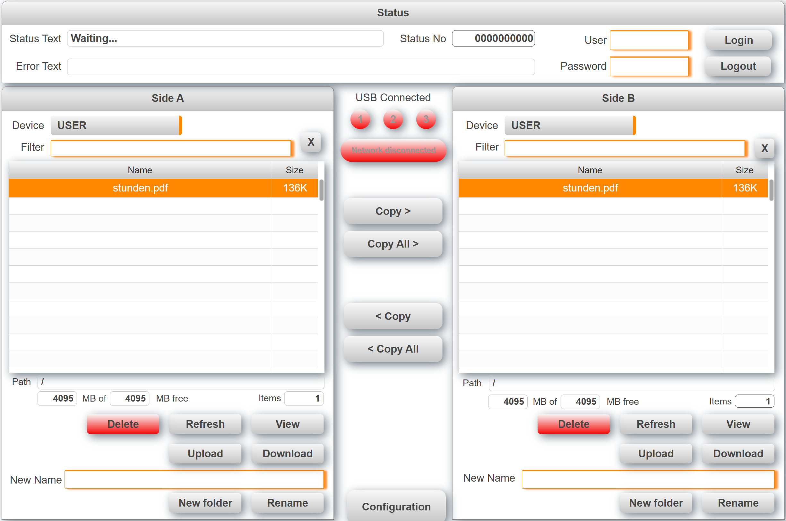

## Introduction
This is a sample project for a file Explorer with mappView. It allows you to delete and copy files or directories between two locations. Navigate through the folder structure by double tapping on a folder name. Access USB sticks and network shares and use them like local folders.

Use [**AS4**](https://github.com/br-automation-community/mappView-File-Explorer/tree/AS4) branch for Automation Studio 4.x

## [**For a detailed description follow this link**](https://br-automation-community.github.io/mappView-File-Explorer/)

